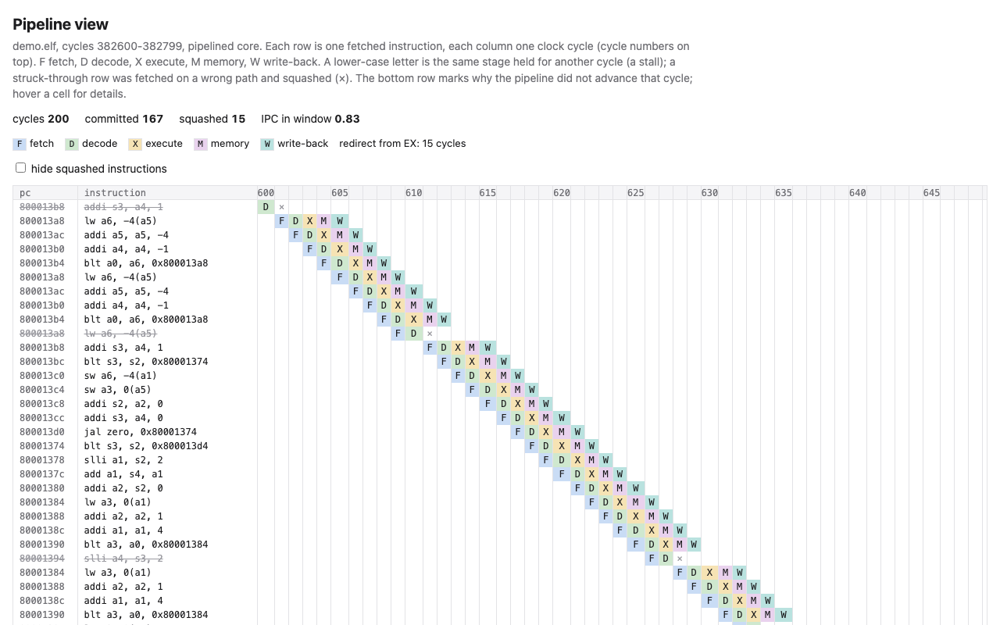

# rv32-pipeline

**Two RISC-V processors written from scratch in SystemVerilog, a single-cycle
reference core and a five-stage pipeline with caches and a branch predictor,
plus the verification that shows they are right: every instruction either core
commits is checked against a golden model, in lockstep, as it happens.**

This is a learning reimplementation of the processor project in MIT 6.1910
(Computation Structures, formerly 6.004), where students build a single-cycle
RISC-V core and then pipelined ones. Nothing here is a new idea. The point is
the engineering around the cores: an executable specification, tests at three
levels, mutations that prove the tests can fail, measured performance with the
commands that produced it, and synthesis for a real FPGA part. Everything runs
in simulation; the cores have **not** been run on a physical board.

[繁體中文說明](README.zh-TW.md) · [Design notes](docs/DESIGN.md) ·
[Project report (6.1910 style)](docs/report.md) · [初學者導讀](docs/導讀.zh-TW.md) ·
[Synthesis report](synth/report.md)


## What is in it

* **Core A** (`rtl/core_single.sv`): single-cycle RV32IM, CPI exactly 1,
  combinational ("magic") instruction and data memory, as in the course's
  first processor lab. Diagram: [docs/single_cycle.svg](docs/single_cycle.svg).
* **Core B** (`rtl/core_pipe.sv`): IF / ID / EX / MEM / WB with forwarding from
  MEM and WB, a one-cycle load-use stall, branch resolution in EX with a
  2-cycle penalty, a predictor (128-entry BTB, 256 two-bit counters, 8-entry
  return-address stack), an iterative divider (one quotient bit per cycle, 34
  cycles in EX), precise exceptions, and
  FENCE.I that writes back the D-cache and invalidates the I-cache.
* **Caches**: 4 KiB direct-mapped I-cache; 4 KiB 2-way LRU, write-back,
  write-allocate D-cache with a store-to-load bypass; both with 16-byte lines
  and synchronous-read arrays that map to block RAM. They share one memory bus
  through an arbiter; the simulation memory answers after a configurable
  latency (default 10 cycles).
* **Golden model** (`model/rv_iss.c`): an instruction-set simulator in C that
  emits one commit record per instruction (pc, instruction, register write,
  memory write, trap). It is also a standalone simulator (`build/rvsim`).
* **Machine mode**: Zicsr, Zifencei, ECALL/EBREAK/MRET, traps for illegal
  instructions and misaligned accesses, `mcycle`, `minstret` and ten hardware
  event counters (cache misses, mispredictions, load-use stalls, ...).
  The exact list is in [docs/DESIGN.md](docs/DESIGN.md#2-isa-what-is-and-is-not-implemented).
* **Software**: a bare-metal runtime (crt0, linker script, console and exit
  registers, printf), a demo program, and CoreMark and Dhrystone fetched at
  pinned commits and built with clang/lld.
* **Pipeline viewer**: `make pipeview` turns a simulation into a static HTML
  page showing which instruction is in which stage on every cycle.
* **Synthesis** of both cores for the Spartan-7 XC7S50 (the Real Digital
  Urbana board, as in the sibling project raycast-fpga) with Yosys.

## Results

All numbers below were measured on this machine (Apple M5, macOS, shared with
other jobs; the results are simulated cycle counts, so load does not change
them) with the commands shown.

| What | Command | Result |
|---|---|---|
| Official riscv-tests, rv32ui + rv32um (pinned commit), golden model alone | `make iss-test` | 50 / 50 pass |
| Same 50 tests on core A and on core B, each in lockstep with the model | `make system` | 100 / 100 pass |
| Random hazard-stressing programs, seeds 1-100, both cores, lockstep | `make system` | 200 / 200 pass |
| Same, seeds 1-1000 (soak) | `make random-soak` | 2,000 / 2,000 pass |
| cocotb unit tests (ALU, register file, decoder, M unit, divider, predictor, I-cache, D-cache, CSRs) | `make unit` | 11 / 11 pass |
| One-line mutations of the RTL and of the model | `make mutants` | 16 / 16 caught |
| `verilator --lint-only -Wall` on both designs | `make lint` | clean |

Benchmarks (from `make bench`, full table in [docs/benchmarks.md](docs/benchmarks.md)):

| Core | CoreMark workload, 40 iterations | Dhrystone, 500 runs |
|---|---|---|
| A, single cycle | 10,362,422 cycles, CPI 1.000, 3.86 iterations per million cycles | 519 cycles/run, 1.10 DMIPS/MHz |
| B, pipelined (default) | 12,201,403 cycles, CPI 1.177, 3.28 iterations per million cycles | 726 cycles/run, 0.78 DMIPS/MHz |
| B with an 8 KiB I-cache | 12,114,455 cycles, CPI 1.169 | 571 cycles/run, 1.00 DMIPS/MHz |

Core B: conditional branches predicted correctly 91.7 % (CoreMark) and 91.9 %
(Dhrystone); jumps and returns 97.2 % and 91.4 %. The pipelined core needs
**more** cycles than the single-cycle one (1.18x on CoreMark); it is faster only
because its clock can be much faster. Yosys' logic-only timing estimate
(`make sta`, [synth/timing.md](synth/timing.md); no routing, not timing
sign-off) puts core A's longest path at
56.0 ns (through the combinational divider) and core B's at 7.8 ns (through the
single-cycle multiplier), which would make core B roughly 6x faster on
CoreMark. [docs/report.md](docs/report.md#7-performance) explains what that
estimate does and does not mean.

**These are not official scores.** The CoreMark workload validates its CRCs,
but it runs in a simulation with a notional 1 MHz clock, built from fetched
sources with our own port layer. Dhrystone is the riscv-tests version built
with clang -O2. Use the numbers only to compare the two cores with each other.

CoreMark® is a registered trademark of EEMBC®. This project runs the unmodified
CoreMark source as a workload inside a simulator; the figures above are
simulated cycle counts, not CoreMark scores, and are not certified by or
submitted to EEMBC.

Synthesis for the XC7S50 (`make synth`, [synth/report.md](synth/report.md)):
core A 4,190 LUTs, 960 flip-flops, 4 DSP48E1; core B 9,305 LUTs, 3,759
flip-flops, 6.5 block RAMs, 4 DSP48E1 (27 % of the chip's LUTs).

## Demo

Double-click `跑跑看.command` in Finder, or run the same steps by hand:

```
$ make build/vsim_pipe build/sw/demo.elf
$ ./build/vsim_pipe --stats build/sw/demo.elf
rv32-pipeline demo: three small programs, each measured by the core's counters

[sieve] cycles=331474 instret=150493 CPI=2.203
[sieve] icache_misses=38 dcache_accesses=27014 dcache_misses=7199 dcache_writebacks=6808 branches=38216 ...
primes below 10000: 1229 (expected 1229)

[quicksort] cycles=48173 instret=42322 CPI=1.138
[quicksort] icache_misses=19 dcache_accesses=7966 dcache_misses=1 dcache_writebacks=0 branches=7355 ...
sorted 400 numbers: ok
...
cycles 817979  instret 577714  CPI 1.4159
```

The sieve's CPI of 2.2 is the D-cache at work: its 10 KB array does not fit
in 4 KiB, so most stores evict a dirty line. When a core disagrees with the
model, the run stops at the first difference. Here is a deliberately broken
core B (MEM-to-EX forwarding removed, one of the mutants `make mutants`
builds) running the same demo. `addi sp, sp, -132` needs the `sp` that the
`auipc` just before it computed; without forwarding it reads the old value 0:

```
LOCKSTEP MISMATCH at commit 35, cycle 155
  last matching commits:
    ...
    8000007c 00002197 auipc gp, 0x2                x3 =8000207c
    80000080 f5818193 addi gp, gp, -168            x3 =80001fd4
    80000084 00100117 auipc sp, 0x100              x2 =80100084
  core : 80000088 f7c10113 addi sp, sp, -132            x2 =ffffff7c
  model: 80000088 f7c10113 addi sp, sp, -132            x2 =80100000
```

`make pipeview` writes `build/pipeview.html`: 200 cycles of the demo's
quicksort, one row per instruction, one column per cycle. Lower-case letters
are stalls, struck-through rows were fetched down a mispredicted path:



## How the verification works

1. **Golden model.** `model/rv_iss.c` implements the ISA from the
   specification, independently of the RTL. It passes all 50 riscv-tests on
   its own.
2. **Lockstep.** Both cores expose a commit port (in the spirit of RVFI): one
   record per finished instruction. The Verilator harness (`sim/sim_main.cpp`)
   steps the model once per record and compares pc, instruction, register
   write, memory write and trap cause. Reads of cycle counters are the only
   values the model takes from the core, because they depend on timing.
3. **riscv-tests** are fetched at a pinned commit and built with our own
   `riscv_test.h` (riscv-tests expects every target to provide one). Our trap
   handler emulates misaligned loads and stores in software, as OpenSBI does,
   which is what `ma_data` needs.
4. **Random programs** (`tests/random/rvgen.py`, fixed seeds, the failing seed
   and a reproduce command are printed) concentrate on what breaks pipelines:
   dependency chains, load-use pairs, branches with work in their shadow,
   2 KiB-strided accesses that collide in one D-cache set, divide edge cases,
   CSR and counter accesses, traps, I/O, and self-modifying code behind FENCE.I.
5. **Unit tests** (cocotb on Icarus) compare each module with a Python model
   written from the ISA, including exact miss and write-back counts for the
   caches and prediction-by-prediction checks of the predictor.
6. **Mutations** (`tools/mutate.py`) prove the tests can fail. Two of them are
   performance bugs that no functional test can see (a frozen LRU bit, stuck
   branch counters); the unit tests catch both and a CoreMark efficiency bound
   catches the second.

## Quick start

Needs Verilator 5 (tested with 5.052 and, in CI, 5.020), Icarus Verilog 12+,
Yosys (0.69 locally, 0.33 in CI), clang with the RISC-V target and ld.lld
(Homebrew LLVM on macOS, since Apple's clang has no RISC-V target), Python 3.10+
and a C++17 compiler.

```sh
brew install verilator icarus-verilog yosys llvm lld   # macOS
make venv          # once: .venv with cocotb and pytest
make test          # lint + model + unit + system tests, about 20 s
make bench         # benchmarks on both cores and five core-B variants, ~3 min
make pipeview      # build/pipeview.html
make synth         # Yosys synthesis of both cores, writes synth/report.md
make sta           # logic-only timing estimate, writes synth/timing.md
make mutants       # mutation check, ~5 min
make random-one SEED=17 CORE=pipe   # one random program with a commit trace
```

Run every target from the repository root. The path may contain spaces or
non-ASCII characters; all paths in the Makefile are relative.

## Repository layout

```
rtl/            decoder, ALU, register file, CSRs, both cores, caches, predictor, divider
rtl/sim/        simulation tops and the memory model (not synthesisable)
model/          golden model (C), disassembler, standalone simulator
sim/            Verilator harness: lockstep checker, statistics, pipeline recorder
sw/runtime/     crt0, linker script, console/exit, printf, counters
sw/demo/        demo programs;  sw/bench/: CoreMark port layer, Dhrystone glue
tests/env/      riscv_test.h and trap handler for the official riscv-tests
tests/random/   random program generator;  tests/unit/: cocotb;  tests/system/: pytest
tools/          pipeline viewer, benchmark driver, mutation tool, synthesis report
synth/          Yosys scripts, synthesis wrappers, report
```

## Limitations

* Simulation only. No board bring-up, no timing closure: the delay estimates
  ignore routing and are not sign-off.
* RV32IM only: no compressed instructions, atomics, floating point,
  interrupts, user mode, virtual memory or PMP. Misaligned loads and stores
  trap (allowed by the ISA); software emulates them.
* The return-address stack and the predictor are updated at EX, not
  speculatively at fetch, so back-to-back returns can mispredict.
* The memory model moves a whole 16-byte line in one beat after a fixed
  latency; real DRAM has bursts, refresh and row effects.
* Core A's memories are combinational; on an FPGA that means distributed RAM
  and a very long clock period. It is a reference, not a practical design.
* The benchmark scores are not official (see above).
* The riscv-tests rv32mi (machine-mode) suite is not run; the trap and CSR
  behaviour it would test is covered by the random programs and unit tests
  against the golden model instead.

## Related work

* **MIT 6.1910 / 6.191 Computation Structures**: students build single-cycle
  and pipelined RISC-V processors in Minispec. This repository follows that
  progression in SystemVerilog; it is not course material.
* **riscv-sodor** (UC Berkeley): educational RV32I cores with 1, 2, 3 and 5
  stages in Chisel; the closest existing project in spirit.
* **PicoRV32** (YosysHQ): a size-optimised, non-pipelined RV32IMC core in
  Verilog, about 4 cycles per instruction and 0.516 DMIPS/MHz by its README.
* **VexRiscv** (SpinalHDL): configurable 2-5+ stage pipeline; its README
  quotes 1.38 DMIPS/MHz and 2.57 CoreMark/MHz for the "full max perf"
  configuration with 8 KiB caches.
* **riscv-formal / RVFI** (YosysHQ): formal verification against an ISA model
  through a per-instruction retirement interface; the commit port here plays
  the same role for simulation, without formal proof.
* **riscv-tests** (riscv-software-src): the official ISA tests used here.

Benchmark numbers from other cores were measured with other compilers,
memories and run rules, so they are context, not a ranking.

## License

MIT (see LICENSE). riscv-tests (BSD-style licence of the Regents of the
University of California) and CoreMark (Apache-2.0 plus
EEMBC's trademark licence for the CoreMark name) are fetched at build time and
are not part of this repository. CoreMark® is a registered trademark of EEMBC®.
