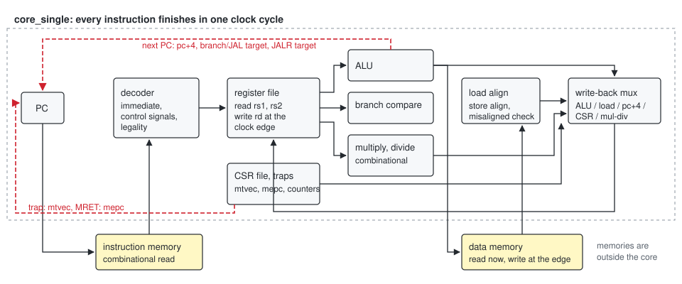
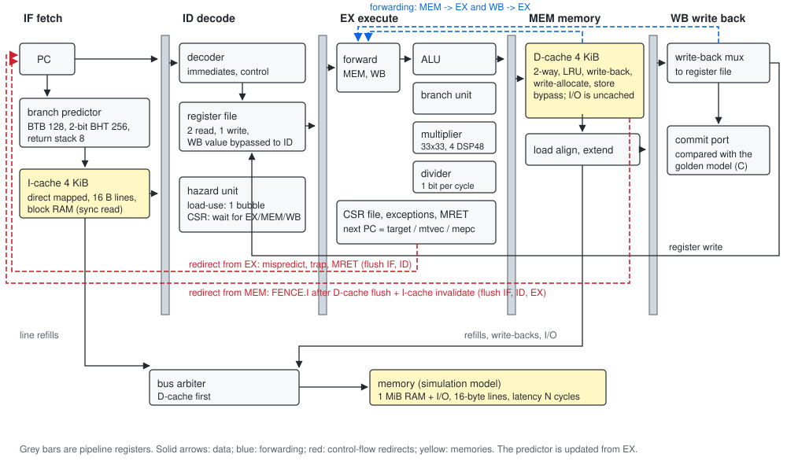

# Design project report: a single-cycle and a pipelined RV32IM processor

*Written in the format of an MIT 6.1910 (Computation Structures) design
project report. This is an independent learning reimplementation; it is not
course material and is not affiliated with MIT.*

## 1. Goal

Build two processors for the same instruction set and measure the difference:

* **Core A**, single cycle: the reference, easy to reason about, CPI = 1.
* **Core B**, five-stage pipeline with hazard handling, a branch predictor and
  caches in front of a slow memory: the realistic design.

Then show that both are correct, with evidence a reviewer can rerun, and
explain where core B's cycles go. Every number in this report comes from a
command in the repository (section 10 lists them) and was measured on an Apple
M5 running macOS 27, shared with other jobs (the numbers are simulated cycle
counts, so host load does not affect them).

## 2. Instruction set

RV32IM + Zicsr + Zifencei, machine mode only, synchronous exceptions only.
The precise list (CSRs, exception causes, `mtval` values, the platform's memory
map and I/O registers) is in [DESIGN.md section 2](DESIGN.md#2-isa-what-is-and-is-not-implemented).
Left out: C, A, F/D, interrupts, U/S modes, virtual memory, PMP, hardware
support for misaligned accesses (they trap; software emulates them).

## 3. Core A: the single-cycle datapath



Everything happens between two clock edges: fetch from a combinational
instruction memory, decode, read two registers, compute (ALU, branch
comparator, combinational multiplier and divider, CSR access), access a
combinational data memory, and write the result back at the edge. The next PC
is selected from pc+4, the branch/JAL target, the JALR target, `mtvec` (trap)
or `mepc` (MRET). Core A itself is about 200 lines of SystemVerilog on top of
the shared modules (decoder, ALU, register file, load/store aligner, CSR file).

## 4. Core B: the pipelined datapath



**Stages.** IF reads the I-cache and asks the predictor for the next PC; ID
decodes, reads registers and detects hazards; EX forwards operands, computes,
resolves branches, raises exceptions and accesses CSRs; MEM accesses the
D-cache; WB writes the register file and reports the instruction on the commit
port.

**Data hazards.** EX takes operands from MEM, then WB, then the register file
(which itself bypasses the WB write to a same-cycle read in ID). A value loaded
in MEM is not available until the end of that cycle, so an instruction that
uses it immediately waits one cycle in ID (one bubble). CSR instructions wait
in ID until the rest of the pipeline is empty, so that `minstret` reads are
exact and CSR writes are visible to later instructions without extra paths.

**Control hazards.** Branches and jumps resolve in EX. Each instruction
carries the PC the fetch stage predicted after it; if EX computes a different
next PC (misprediction, trap, MRET), IF and ID are flushed and fetch restarts
at the right place: a 2-cycle penalty. FENCE.I waits in MEM until the D-cache
has written back its dirty lines and the I-cache has invalidated itself, then
flushes IF, ID and EX and refetches.

**Structural hazards.** The iterative divider holds EX for 34 cycles; both
caches share one memory bus through an arbiter that favours the D-cache.

**One non-obvious case.** When MEM stalls on a cache miss, the instruction in
WB retires and WB empties. An instruction waiting in EX that was getting an
operand forwarded from WB would lose it, so EX rewrites its operand registers
with the forwarded values every cycle it is held. Removing that line is one of
the mutants in section 6.3; the tests catch it.

The stall and flush logic reduces to six signals; the table is in
[DESIGN.md 5.1](DESIGN.md#51-stall-and-flush-rules).

## 5. Caches and branch predictor

**I-cache**: 4 KiB, direct mapped, 16-byte lines. **D-cache**: 4 KiB, two
ways, one LRU bit per set, write-back, write-allocate, 16-byte lines; I/O
addresses bypass it. Both keep tags and data in synchronous-read arrays
(block RAM on the FPGA), so the pipeline gives them the address one cycle
ahead and the hit check happens in the stage itself. A miss writes back a
dirty victim if needed, refills the line in one bus transaction, re-reads the
arrays for one cycle and then hits. Because the data array is written at the
same clock edge at which the next access reads it, a one-entry bypass merges a
store's bytes into the following read. Details and the alternatives considered
are in [DESIGN.md 6](DESIGN.md#6-caches-and-memory-bus).

**Memory.** The simulation memory accepts one request at a time and answers
after a fixed latency (10 cycles by default), moving a whole line at once.

**Predictor.** 128-entry BTB (full tags; target and kind), 256 two-bit
counters, 8-entry return-address stack using the ISA's `ra`/`t0` hints. All
are updated in EX when an instruction resolves, never on the wrong path.

## 6. Verification

### 6.1 Strategy

| Level | What | Reference | Where |
|---|---|---|---|
| Module | ALU, register file, decoder, M unit, divider, predictor, I-cache, D-cache, CSR file | Python models written from the ISA; exact counts for caches and predictor | `tests/unit` (cocotb, Icarus) |
| ISA | 50 official riscv-tests (rv32ui, rv32um) | the tests check themselves, and run in lockstep | `tests/system/test_riscv_tests.py` |
| Hazards | random programs, 100 fixed seeds, about 3,000 instructions each | lockstep with the golden model | `tests/random/rvgen.py`, `tests/system/test_random.py` |
| Programs | demo, CoreMark, Dhrystone | lockstep, plus CoreMark's own CRC checks | `make bench`, `tests/system/test_perf.py` |
| The tests themselves | 16 one-line mutations | each must make a test fail | `tools/mutate.py` |

**Lockstep.** The golden model (`model/rv_iss.c`) is an independent C
implementation of the ISA. The harness steps it once for every instruction a
core commits and compares pc, instruction, register write, memory write and
trap. Timing-dependent counter reads are the only values the model adopts from
the core. The first difference stops the run and prints the last eight
matching instructions, which makes failures quick to diagnose:

```
LOCKSTEP MISMATCH at commit 35, cycle 155
  last matching commits:
    80000068 00000d93 addi s11, zero, 0            x27=00000000
    ...
    80000084 00100117 auipc sp, 0x100              x2 =80100084
  core : 80000088 f7c10113 addi sp, sp, -132            x2 =ffffff7c
  model: 80000088 f7c10113 addi sp, sp, -132            x2 =80100000
```

(Core B with MEM-to-EX forwarding removed, running the demo program: the
`addi` needs the `sp` computed by the `auipc` right before it.)

**riscv-tests environment.** riscv-tests expects each target to supply its own
`riscv_test.h`. Ours (`tests/env`) sets up machine mode, reports through the
EXIT register and installs a trap handler that emulates misaligned loads and
stores byte by byte, which is what `ma_data` requires on hardware that traps
on misaligned accesses. Any other trap fails the test.

**Random programs** always terminate (forward branches, counted loops) and
aim at the hard cases: sources drawn mostly from the last four destinations,
loads followed by their use, stores followed by loads of the same word, one
to four instructions (including loads, stores, divides and CSR accesses) in
every branch shadow, accesses at 2 KiB strides that land in one D-cache set,
divide by 0 / -1 / INT_MIN, reads of `minstret` and of timing-dependent
counters, writes to `mscratch`/`mepc`/`mcause`/`mtval`, ECALL, EBREAK, illegal
encodings, misaligned accesses and jumps (the handler skips the instruction),
console I/O, and instructions patched in memory and made visible with
FENCE.I. Seed 3 on core B, for example, produces 338 D-cache misses with 204
dirty write-backs, 245 branch mispredictions, 38 traps and 14 FENCE.I in 7,451
instructions.

### 6.2 Results

| Suite | Command | Result |
|---|---|---|
| riscv-tests on the golden model alone | `make iss-test` | 50 / 50 |
| riscv-tests, core A and core B in lockstep | `make system` | 100 / 100 |
| random programs, seeds 1-100, both cores | `make system` | 200 / 200 |
| CoreMark efficiency bounds on core B | `make system` | pass |
| cocotb unit tests | `make unit` | 11 / 11 |
| `verilator --lint-only -Wall` | `make lint` | clean |
| mutations | `make mutants` | 16 / 16 caught |

### 6.3 Mutation results

Each mutant is a one-line change. "random" counts how many of 30 random
programs failed; "perf" is the CoreMark run of `test_perf.py`, which fails
on a lockstep mismatch as well as on an efficiency bound. Generated by
`make mutants` ([full table](mutants.md)):

| Mutant | What it breaks | Caught by |
|---|---|---|
| `fwd_mem` | no MEM->EX forwarding for rs1 | 50 riscv-tests, 30 random, perf |
| `fwd_wb` | no WB->EX forwarding for rs2 | 10 riscv-tests, 30 random, perf |
| `no_load_use` | load-use hazard not detected | 6 riscv-tests, 30 random, perf |
| `no_id_flush` | ID not flushed on a misprediction | 1 riscv-test, 30 random, perf |
| `no_operand_refresh` | EX loses a forwarded operand while held | 1 riscv-test, 30 random, perf |
| `dirty_lost` | store hit does not set the dirty bit | unit, 1 riscv-test, 30 random, perf |
| `no_store_bypass` | load after a store to the same line reads stale data | unit, 5 riscv-tests, 30 random |
| `lru_frozen` | LRU bit not updated on hits (performance only) | unit test only |
| `fencei_no_inval` | FENCE.I leaves stale instructions in the I-cache | unit, 30 random |
| `bht_stuck` | counters never move toward taken (performance only) | unit, perf |
| `sra_logical` | SRA shifts in zeros | unit, 4 riscv-tests and 30 random on each core, perf |
| `rem_sign` | REM sign wrong for negative dividends | unit, 1 riscv-test, 29 random |
| `branch_legal` | reserved branch encodings accepted | unit, 29 random on each core |
| `mepc_unmasked` | `mepc` keeps its low two bits | unit, 14 random on each core |
| `single_bltu` | core A compares BLTU as signed | 1 riscv-test, 30 random |
| `model_mulhsu` | golden model: MULHSU treats rs2 as signed | riscv-tests on the model |

What this taught: the official `fence_i` test does not notice a missing
I-cache invalidation (the lines it patches were never cached), but the random
programs do. The first run of this table had `branch_legal` and
`mepc_unmasked` caught only by unit tests; the random generator was extended
(reserved encodings, `mepc`/`mcause`/`mtval` writes) until system tests
caught them too. Performance bugs are invisible to lockstep by design, which
is why the predictor and cache unit tests check exact counts and why CoreMark
has efficiency bounds; `lru_frozen` changes CoreMark's miss count too little
to cross them, so only its unit test catches it.

## 7. Performance

### 7.1 Method

`make bench` builds CoreMark (40 iterations, performance-run seeds, 2 KB of
data) and Dhrystone (riscv-tests version, 500 runs) with clang -O2 for rv32im,
runs them on both cores in lockstep, and reads the core's own counters around
each benchmark's timed region. Core B also runs in five variants (predictor
off, no return stack, 8 KiB I-cache, memory latency 1 and 30). Full table:
[benchmarks.md](benchmarks.md).

### 7.2 Results

| Configuration | CoreMark cycles | CPI | CoreMark/MHz | Dhrystone cycles/run | CPI | DMIPS/MHz |
|---|---:|---:|---:|---:|---:|---:|
| A: single cycle | 10,362,422 | 1.000 | 3.86 | 519 | 1.000 | 1.10 |
| B: default | 12,201,403 | 1.177 | 3.28 | 726 | 1.398 | 0.78 |
| B: predictor off | 14,587,065 | 1.408 | 2.74 | 896 | 1.726 | 0.64 |
| B: no return stack | 12,226,219 | 1.180 | 3.27 | 732 | 1.410 | 0.78 |
| B: 8 KiB I-cache | 12,114,455 | 1.169 | 3.30 | 571 | 1.100 | 1.00 |
| B: memory latency 1 | 12,061,923 | 1.164 | 3.32 | 617 | 1.188 | 0.92 |
| B: memory latency 30 | 12,511,363 | 1.207 | 3.20 | 969 | 1.866 | 0.59 |

Core B (default) predicts 91.7 % of CoreMark's conditional branches and
97.2 % of its jumps and returns; for Dhrystone 91.9 % and 91.4 %. I-cache hit
rate 99.85 % (CoreMark) and 97.71 % (Dhrystone); D-cache hit rate above
99.99 % and 99.98 %.

**These are not official scores.** CoreMark validates its CRCs ("Correct
operation validated") and, counting one cycle as one microsecond, runs 12.2
"seconds", past its 10-second minimum; but the clock is notional, the
platform is a simulation, and the result has not been submitted to EEMBC.
Dhrystone is compiled with -O2 by clang, with the riscv-tests harness. The
figures are for comparing the two cores and the variants with each other.

### 7.3 Where core B's cycles go

CoreMark, default configuration: 1,838,966 cycles more than instructions.

| Cause | Events | Cycles | Share |
|---|---:|---:|---:|
| load-use bubbles | 1,276,618 | 1,276,618 | 69 % |
| conditional branch mispredictions (2 cycles each) | 175,508 | 351,016 | 19 % |
| I-cache misses (memory latency + about 2 cycles each) | 15,469 | about 185,000 | 10 % |
| jump and return mispredictions | 6,389 | 12,778 | 0.7 % |
| D-cache misses, CSR drains, divides | | about 13,000 | 0.7 % |

CoreMark is dominated by load-use pairs: its list traversal and state machine
load a value and use it right away, and the compiler does not schedule for
this pipeline. Dhrystone is different: of its 103,393 extra cycles about 70 %
are I-cache misses (6,075, twelve per run: its hot code does not fit a 4 KiB
direct-mapped cache without conflicts). The 8 KiB variant removes them
(I-cache hit rate 99.97 %, CPI 1.10). The latency variants confirm the
accounting: going from latency 10 to 1 saves 54,609 cycles on Dhrystone, and
9 cycles times its 6,107 misses and write-backs predicts 54,963.

The predictor matters most: turning it off costs 20 % on CoreMark (CPI 1.177
to 1.408) and 23 % on Dhrystone. The return stack lifts Dhrystone's jump
prediction from 78.9 % to 91.4 %. During development the BTB had only 32
entries; over the whole Dhrystone program that predicted 46 % of jumps and
92.0 % of branches, and 128 entries raised them to 95 % and 94.9 %: the
counters were fine, the BTB was too small.

### 7.4 Single cycle against pipelined

Core B needs **more** cycles than core A: 1.18x on CoreMark, 1.40x on
Dhrystone. The pipeline can only win through its clock. Without place and
route there is no clock frequency to measure, so the best available evidence
is Yosys' static timing pass over its 7-series cell delay models (`make sta`):
logic delay only, no routing, which on an FPGA is often half of a real path.

| | Longest path (logic only) | Ends at |
|---|---:|---|
| Core A | 56.0 ns | register-file write data, through the 32-step combinational divider |
| Core B | 8.0 ns | EX result, through the 33x33 multiplier (DSP48E1 cascade) and the result mux |

With those delays CoreMark would take 580.8 ms on core A and 97.8 ms on core
B, about 5.9x; Dhrystone about 5.0x. Treat this as an illustration of why
pipelines exist rather than as a measurement: core A's path is dominated by a
divider no practical single-cycle design would keep, its memories are outside
the analysed netlist (a real single-cycle core would add an instruction-memory
and a data-memory access to the same path), and routing is missing for both.

## 8. Resource usage

Yosys `synth_xilinx` for the Spartan-7 XC7S50 (`make synth`,
[full report](../synth/report.md)). Each core is synthesised behind a wrapper
that exposes only its memory interface, so the commit port and viewer probes
do not count.

| | LUTs | Flip-flops | Block RAM (36 Kb) | DSP48E1 |
|---|---:|---:|---:|---:|
| Core A | 4,190 (12.9 %) | 960 | 0 | 4 |
| Core B | 8,754 (26.9 %) | 3,759 | 6.5 | 4 |

In core B the D-cache is the largest block (about 3,200 LUTs: 128-bit line
multiplexers for two ways, the store bypass and the write-back buffer),
followed by the CSR file (about 1,500 LUTs, mostly twelve 64-bit counters) and
the predictor (about 1,100 LUTs, the BTB in distributed RAM). The cache arrays
use 6.5 block RAMs. Both cores fit comfortably; neither has been placed,
routed or run on a board.

## 9. Challenges and lessons

* **Block RAM changes the pipeline.** Synchronous-read arrays mean the cache
  must see the address a cycle early. Getting that "next address" right in
  every stall and redirect case was the most delicate part of core B, and it
  is why the cache unit tests drive the caches exactly as the pipeline does.
* **Read-during-write.** A store hit and the next access touch the same array
  at the same clock edge. The bypass that fixes it is easy to forget; the
  mutant that removes it fails the unit test, five riscv-tests and every
  random program.
* **Stalls interact.** A miss in MEM changes what EX can forward from WB
  (section 4). Reasoning about each stage in isolation is not enough; random
  programs are what exercise the combinations.
* **Measure before tuning.** The first predictor numbers looked like a counter
  problem; the per-event counters showed it was BTB capacity.
* **A test suite has to prove it can fail.** The mutation run found two holes
  in the system tests (now closed) and one in the official riscv-tests.
* **Old tools in CI.** Keeping to a subset that Ubuntu's Verilator 5.020,
  Icarus 12 and Yosys 0.33 accept meant no packages, structs or casts to
  parameter widths.

## 10. Reproducing

```sh
make venv        # once
make test        # lint, golden model, unit and system tests (about 20 s)
make mutants     # mutation table (about 5 min)
make bench       # benchmark table (about 3 min)
make synth       # synthesis report;  make sta for the delay estimate
make pipeview    # pipeline viewer page
```

Pinned third-party sources: riscv-tests `bcffa2b3188b040c611f90dc0b6e422f54775a09`,
CoreMark `1f483d5b8316753a742cbf5590caf5bd0a4e4777`. Tools used here:
Verilator 5.052, Icarus Verilog 13.0, Yosys 0.69, clang and lld 23.1.

## 11. Future work

* **Put it to use.** Connect core B to the sibling project raycast-fpga's
  video pipeline on the Urbana board: the CPU would run the game logic and
  write the map and player state that the hardware raycaster reads, replacing
  its fixed-function player FSM. That needs a memory-mapped register block, an
  FPGA memory controller instead of the simulation model, and real timing
  closure.
* **Shorten the critical path**: a two-stage multiplier, then place and route
  with a vendor or open flow to get a real Fmax.
* **Reduce the load-use cost**, 69 % of CoreMark's stall cycles: compiler
  scheduling for this pipeline, or a faster load path.
* **Better prediction**: gshare or a tournament predictor, and a speculative
  return stack with repair.
* **Out-of-order execution**: a small Tomasulo-style core with a reorder
  buffer. The commit port and the lockstep checker work at retirement, so they
  would carry over unchanged.
* **Formal verification** of core B with riscv-formal, through an RVFI wrapper
  around the commit port.
* **Interrupts**: a timer interrupt would make the CSR file complete enough to
  run the machine-mode riscv-tests (rv32mi).
